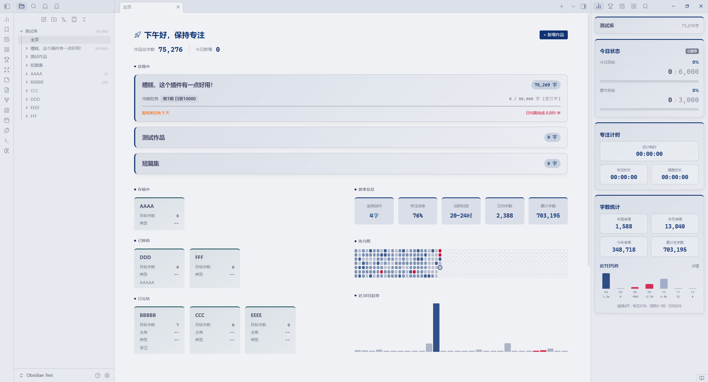
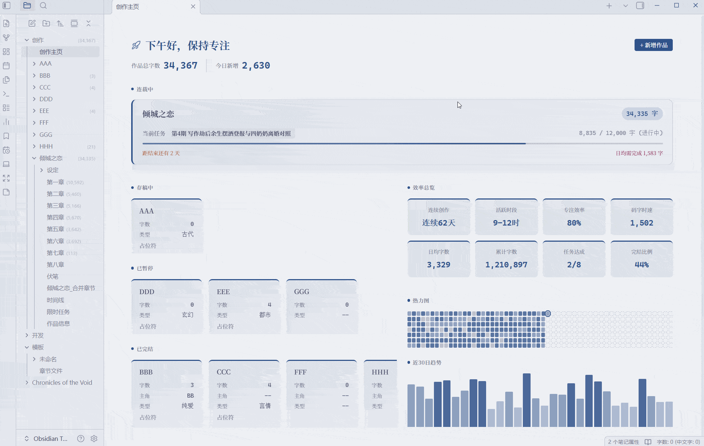
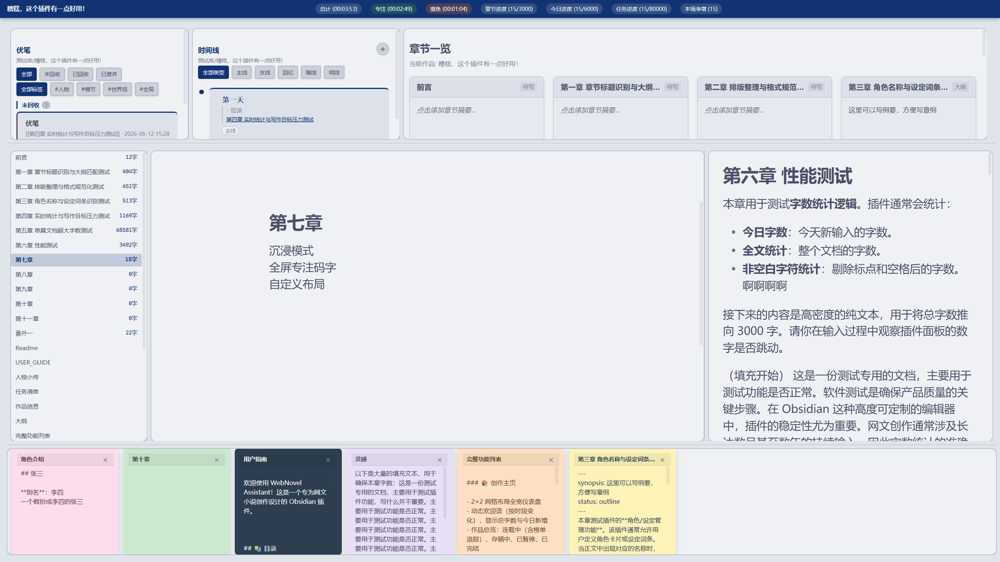
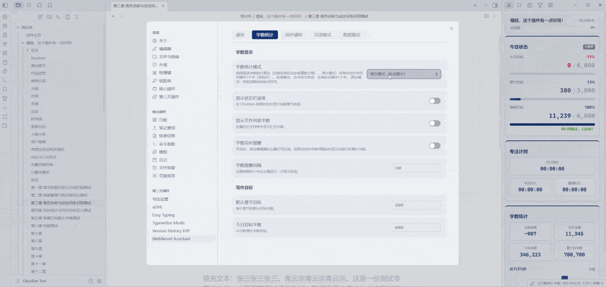
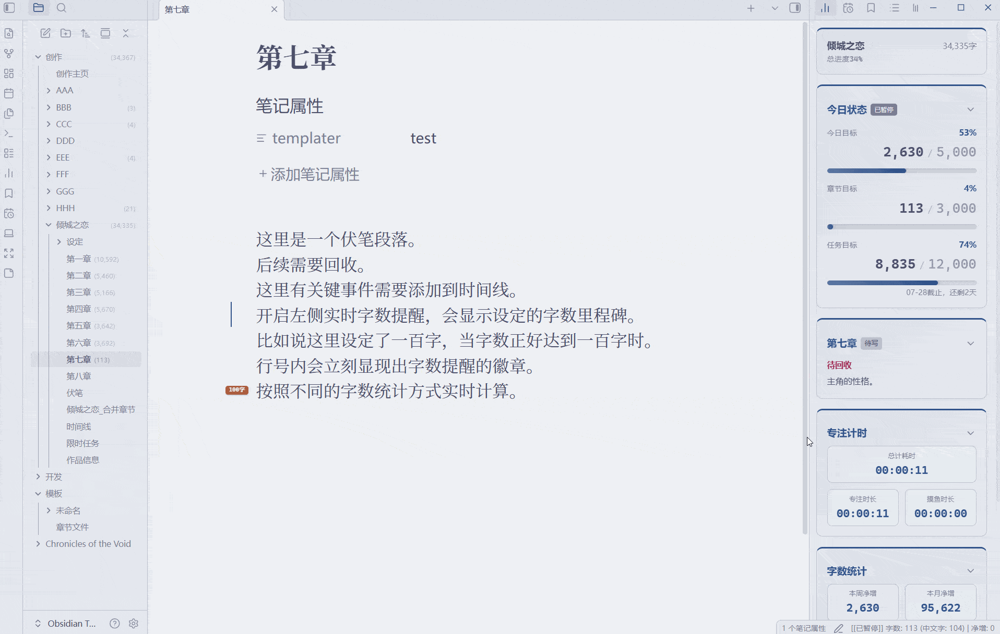
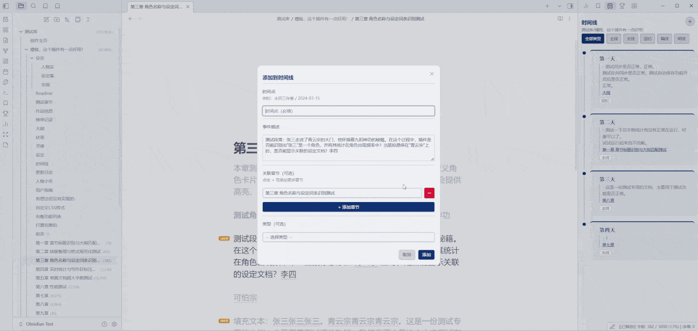
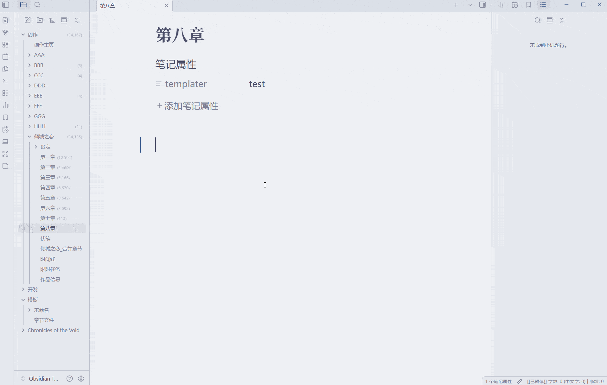
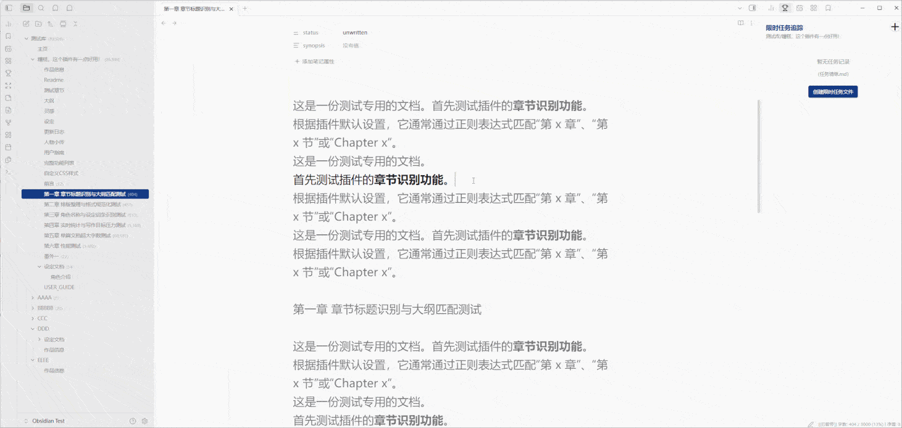
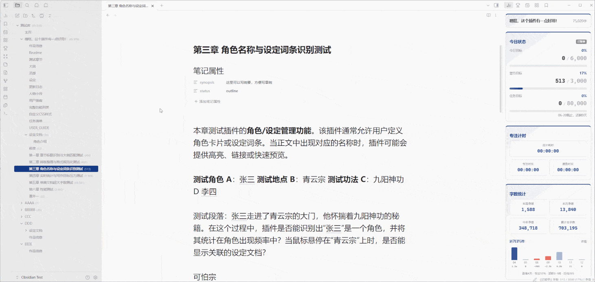
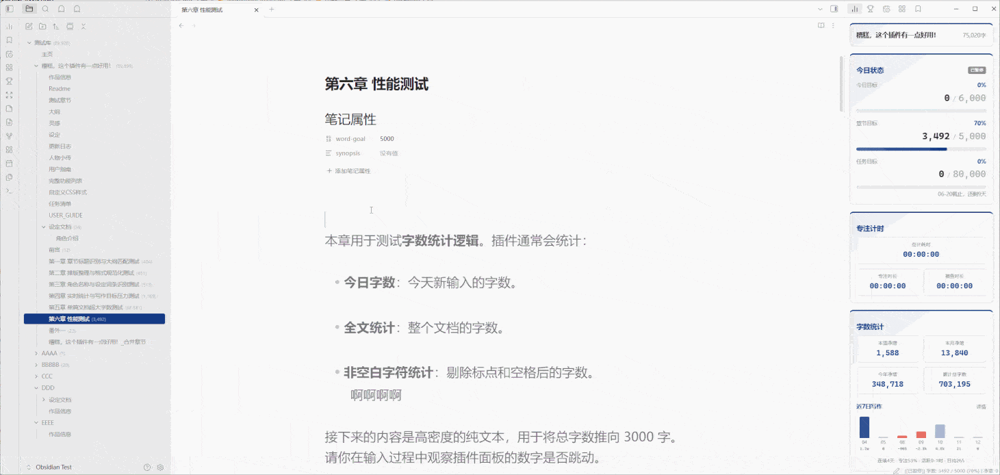

# ✍️ WebNovel Assistant

**English** | **[中文](#中文)**

A powerful Obsidian plugin built for web novel writers.  
Full bilingual UI (Chinese & English) — homepage, word count, goal tracking, foreshadowing, timeline, timed tasks, OBS overlay & more.

 

<a href="doc/USER_GUIDE_EN.md"><kbd>📖 User Guide</kbd></a>
<a href="doc/OBS_OVERLAY_CSS_GUIDE_EN.md"><kbd>🎥 OBS CSS Guide</kbd></a>
<a href="doc/CHANGELOG.md"><kbd>📋 Changelog</kbd></a>

  

 

## ✨ Feature Highlights

<table>
<tr>
<td width="50%">

### 🏠 Creative Homepage
- **Full-width Dashboard** — 2×2 grid fills editor
- **Dynamic Welcome** — time-based greeting, total words & net increase
- **Novel Overview** — In Progress / Drafting / Paused / Completed
- **Stats Panel** — efficiency card, 365 heatmap, 30-day trend
- **One-Click New Novel** — metadata dialog → auto-create workspace

</td>
<td width="50%">

</td>
</tr>
<tr>
<td width="50%">

### 🌑 Immersive Writing Mode
- **Full-screen Focus** — hide all distractions
- **Dynamic Dashboard** — title, timer, words & focus score
- **Slot-based Layout** — panels to top/bottom/left/right, main area auto-snaps

</td>
<td width="50%">

</td>
</tr>
<tr>
<td width="50%">

### 📊 Word Count & Goals
- **3 Counting Modes** — Webnovel / Standard / Obsidian Native
- **Multi-direction Goal Tracking** — chapter, daily & timed task goals, real-time progress
- **Strict Chapter Mode** — restrict which documents count as "chapters" for precise word stats
- **Smart Chapter Sorting** — overrides Obsidian's sort logic, supports regex patterns
- **Real-time Word Reminder** — left gutter area shows live word count progress
- **Folder Word Count Display** — file & folder word counts shown in explorer sidebar

</td>
<td width="50%">

</td>
</tr>
<tr>
<td width="50%">

### ⏱️ Focus Time Tracking
- Auto focus vs. slack detection
- Web Worker — zero editing impact
- **365 Heatmap**, bar+line trend, efficiency card, cumulative stats

</td>
<td width="50%">

</td>
</tr>
</table>

### 📝 Creative Assistants

<table>
<tr>
<td width="33%" align="center"><b>Foreshadowing Manager</b> Mark → Track → Recover across chapters  </td>
<td width="33%" align="center"><b>Timeline System</b> Events, multi-chapter links, custom types  </td>
<td width="33%" align="center"><b>Chapter Corkboard</b> Card overview, status & synopsis editing  </td>
</tr>
<tr>
<td width="33%" align="center"><b>Lore Quick Lookup</b> Auto-highlight, hover preview, right-click add  </td>
<td width="33%" align="center"><b>Sticky Notes</b> Floating, auto-save, sync, Markdown render  </td>
<td width="33%" align="center"><b>Task Tracker</b> Create periodic tasks, self-driven deadlines  </td>
</tr>
<tr>
<td width="33%" align="center"><b>Advanced Search</b> Search by book, global or custom scope, quick jump  </td>
<td width="33%" align="center"><b>Merge Chapters</b> Merge all chapters in a folder by sort order  </td>
<td width="33%" align="center"><b>Auto-Create Next Chapter</b> Auto-create numbered chapter documents  </td>
</tr>
</table>

### 🎥 OBS Streaming Overlay & 📱 Mobile

| 🎥 OBS Overlay | 📱 Mobile |
|:---|:---|
| Real-time writing stats in OBS | Floating word count widget |
| Custom style, opacity & content | Touch-optimized, anti-mistouch |
| Zero latency, zero disk I/O | **Copy Document** — one-click with title prepended |

 

## 📥 Installation

| Method | Steps |
|:-------|:------|
| **Community Plugins** *(Recommended)* | Settings → Community Plugins → Browse → Search **"WebNovel Assistant"** → Install → Enable |
| **BRAT** | Install [BRAT](https://github.com/TfTHacker/obsidian42-brat) → Add repo `HatanoChihiro/obsidian-webnovel-assistant` → Enable |
| **Manual** | [Download](https://github.com/HatanoChihiro/obsidian-webnovel-assistant/releases) → Extract to `.obsidian/plugins/web-novel-assistant/` → Restart & Enable |

## 🚀 Quick Start

1. **Install** → open any Markdown file
2. **Status bar** shows live word count → click to set a goal
3. **Command Palette** `Ctrl/Cmd+P` → search "WebNovel"
4. **Settings** → customize each feature

<kbd>🎯 Key Commands</kbd>

| Command | Description |
|---------|-------------|
| Toggle Immersive Writing Mode | Full-screen distraction-free writing |
| Toggle Writing Status Panel | Detailed stats & history charts |
| Toggle Foreshadowing Panel | Manage foreshadowing & recovery |
| Toggle Timeline Panel | Manage story timeline |
| Toggle Timed Task Panel | Timed writing task tracking |
| Toggle Chapter Corkboard | Card-style chapter overview |
| Start/Pause Slack Time Tracking | Toggle focus/slack tracking |
| Mark as Foreshadowing | Mark selected text as foreshadowing |
| Create Blank Sticky Note | New floating sticky note |
| Advanced Search | Search by book/global/custom scope |
| Auto-Create Next Chapter | Smart chapter numbering |
| Reset Streaming Stats | Clear current session data |

> All commands can get custom shortcuts in **Settings → Hotkeys**

<kbd>⚙️ Key Settings</kbd>

| Setting | Default | Description |
|---------|---------|-------------|
| Language | Auto | UI language — auto-detects Obsidian locale |
| Default Chapter Goal | 3000 | Chapter word goal for new files |
| Daily Goal | 5000 | Daily writing target |
| File Explorer Word Count | Off | Folder word counts in sidebar |
| Smart Chapter Sorting | Off | Auto-sort by chapter numbers |
| Eye Care Mode | Off | Warm background color |
| Immersive Note Size | 280px | Sticky note card size in immersive mode |
| Foreshadowing Filename | `Foreshadowing` | Customizable per workspace |
| Timeline Filename | `Timeline` | Customizable per workspace |
| Timed Task Filename | `Timed Task` | Customizable per workspace |
| Lore Folder Name | `Lore` | Supports dictionary outline mode |
| Word Count Mode | Webnovel | Webnovel / Standard / Native algorithm |

<kbd>🎨 OBS Overlay Setup</kbd>

1. Plugin settings → Enable **OBS Overlay**
2. OBS → Add **Browser Source** → URL `http://127.0.0.1:24816/`
3. Recommended: **300×500px**

See [OBS Overlay CSS Guide](doc/OBS_OVERLAY_CSS_GUIDE_EN.md) for full customization.

 

## 📄 License & 💖 Support

[MIT License](LICENSE)

⭐ Star · 🐛 [Issues](https://github.com/HatanoChihiro/obsidian-webnovel-assistant/issues) · 💡 [Discussions](https://github.com/HatanoChihiro/obsidian-webnovel-assistant/discussions)

**Happy writing!** ✍️

---

# ✍️ WebNovel Assistant

**[English](#english)** | **中文**

为网络小说作者打造的 Obsidian 插件。  
中文 & 英文双语界面 — 创作主页、字数统计、目标追踪、伏笔管理、时间线、限时任务、OBS叠加层等。

 

<a href="doc/USER_GUIDE.md"><kbd>📖 使用指南</kbd></a>
<a href="doc/OBS_OVERLAY_CSS_GUIDE.md"><kbd>🎥 OBS CSS 指南</kbd></a>
<a href="doc/CHANGELOG.md"><kbd>📋 更新日志</kbd></a>

  

 

## ✨ 功能一览

<table>
<tr>
<td width="50%">

### 🏠 创作主页
- **全宽仪表盘** — 2行×2列网格，填满编辑器
- **动态欢迎语** — 根据时段变化，显示总字数与今日净增
- **作品总览** — 连载中/存稿中/已暂停/已完结一目了然
- **数据面板** — 效率总览、365热力图、30日趋势
- **一键新建** — 弹窗填元数据 → 自动创建工作区

</td>
<td width="50%">

</td>
</tr>
<tr>
<td width="50%">

### 🌑 沉浸写作模式
- **全屏专注** — 隐藏所有干扰
- **动态仪表盘** — 标题、计时器、字数与专注度
- **插槽化布局** — 辅助面板分配上下左右，主区自动贴边

</td>
<td width="50%">

</td>
</tr>
<tr>
<td width="50%">

### 📊 字数统计与目标追踪
- **3种字数统计模式** — 网文/标准/Obsidian原生
- **多向目标追踪** — 章节、今日、任务目标，实时进度可视化
- **严格章节模式** — 限制“章节”所包括的文档，精准计算字数
- **智能章节排序** — 覆盖Obsidian排序逻辑，支持正则表达式
- **实时字数提醒** — 编辑器左侧行号位置提示实时字数进度
- **文件夹字数显示** — 列表右侧显示文档和文件夹字数

</td>
<td width="50%">

</td>
</tr>
<tr>
<td width="50%">

### ⏱️ 专注时间追踪
- 自动区分专注与摸鱼
- Worker 线程 — 不影响编辑
- **365热力图**、柱状+趋势、效率卡片、累计字数

</td>
<td width="50%">

</td>
</tr>
</table>

### 📝 创作辅助工具

<table>
<tr>
<td width="33%" align="center"><b>伏笔管理</b> 标注 → 追踪 → 多章节回收  </td>
<td width="33%" align="center"><b>时间线系统</b> 事件记录、多章节关联、类型分类  </td>
<td width="33%" align="center"><b>章节一览</b> 卡片式展示、状态标记、摘要编辑  </td>
</tr>
<tr>
<td width="33%" align="center"><b>设定速查</b> 自动标注、悬停预览、右键边写边建  </td>
<td width="33%" align="center"><b>悬浮便签</b> 多端同步、自动保存、Markdown渲染  </td>
<td width="33%" align="center"><b>任务追踪</b> 创建周期任务，自我驱动  </td>
</tr>
<tr>
<td width="33%" align="center"><b>高级搜索</b> 支持当前书籍、全局、自定义，快速跳转  </td>
<td width="33%" align="center"><b>合并章节</b> 按照排序合并目录内所有章节  </td>
<td width="33%" align="center"><b>自动创建下一章</b> 自动创建带标号章节文档  </td>
</tr>
</table>

### 🎥 OBS直播叠加层 & 📱 移动端

| 🎥 OBS叠加层 | 📱 移动端 |
|:---|:---|
| 实时显示写作数据 | 浮动字数统计窗口 |
| 自定义样式、透明度、内容 | 触摸优化、防误触 |
| 零延迟、零磁盘消耗 | **复制本文档** — 一键带标题复制 |

 

## 📥 安装

| 方式 | 步骤 |
|:-----|:-----|
| **社区插件市场** *(推荐)* | 设置 → 第三方插件 → 浏览 → 搜索 **"WebNovel Assistant"** → 安装 → 启用 |
| **BRAT** | 安装 [BRAT](https://github.com/TfTHacker/obsidian42-brat) → 添加仓库 `HatanoChihiro/obsidian-webnovel-assistant` → 启用 |
| **手动安装** | [下载](https://github.com/HatanoChihiro/obsidian-webnovel-assistant/releases) → 解压到 `.obsidian/plugins/web-novel-assistant/` → 重启启用 |

## 🚀 快速开始

1. **安装插件** → 打开任意 Markdown 文件
2. **状态栏**显示实时字数 → 点击设置目标
3. **命令面板** `Ctrl/Cmd+P` → 搜索 "WebNovel"
4. **设置** → 自定义各项功能

<kbd>🎯 主要命令</kbd>

| 命令 | 说明 |
|------|------|
| 进入/退出 沉浸写作模式 | 切换全屏沉浸创作环境 |
| 打开/关闭写作实时状态面板 | 详细统计和历史图表 |
| 打开/关闭伏笔面板 | 管理伏笔标注和回收 |
| 打开/关闭时间线面板 | 管理故事时间线 |
| 打开/关闭限时任务面板 | 管理限时任务追踪 |
| 打开/关闭章节一览面板 | 卡片式展示章节纲要 |
| 开始/暂停 摸鱼时间统计 | 切换时间追踪 |
| 标注为伏笔 | 将选中文字标注为伏笔 |
| 新建空白悬浮便签 | 创建浮动便签 |
| 高级搜索 | 搜索书籍/全局/自定义范围 |
| 自动创建下一章 | 智能递增章节编号 |
| 重置直播统计数据 | 清空当前会话数据 |

> 所有命令可在 **设置 → 快捷键** 中自定义

<kbd>⚙️ 主要设置</kbd>

| 设置 | 默认值 | 说明 |
|------|--------|------|
| 语言 | 跟随系统 | 界面语言，首次安装自动检测 |
| 默认目标字数 | 3000 | 新文件的默认章节目标 |
| 今日目标字数 | 5000 | 今日写作目标 |
| 文件浏览器字数统计 | 关闭 | 大型项目建议关闭 |
| 智能章节排序 | 关闭 | 自动按章节编号排序 |
| 护眼模式 | 关闭 | 编辑器背景护眼色 |
| 沉浸便签尺寸 | 280px | 沉浸模式下便签卡片边长 |
| 伏笔文件名 | `伏笔` | 可按工作区自定义 |
| 时间线文件名 | `时间线` | 可按工作区自定义 |
| 限时任务文件名 | `限时任务` | 可按工作区自定义 |
| 设定文件夹名称 | `设定` | 支持字典大纲模式 |
| 字数统计模式 | 网文模式 | 网文/标准/原生 统计算法 |

<kbd>🎨 OBS叠加层设置</kbd>

1. 插件设置 → 启用 **OBS叠加层**
2. OBS → 添加 **浏览器源** → URL `http://127.0.0.1:24816/`
3. 建议 **300×500px**

详见 [OBS叠加层CSS指南](doc/OBS_OVERLAY_CSS_GUIDE.md)

 

## 📄 许可证 & 💖 支持项目

[MIT License](LICENSE)

⭐ Star · 🐛 [提交问题](https://github.com/HatanoChihiro/obsidian-webnovel-assistant/issues) · 💡 [功能建议](https://github.com/HatanoChihiro/obsidian-webnovel-assistant/discussions)

**祝你写作愉快！** ✍️

